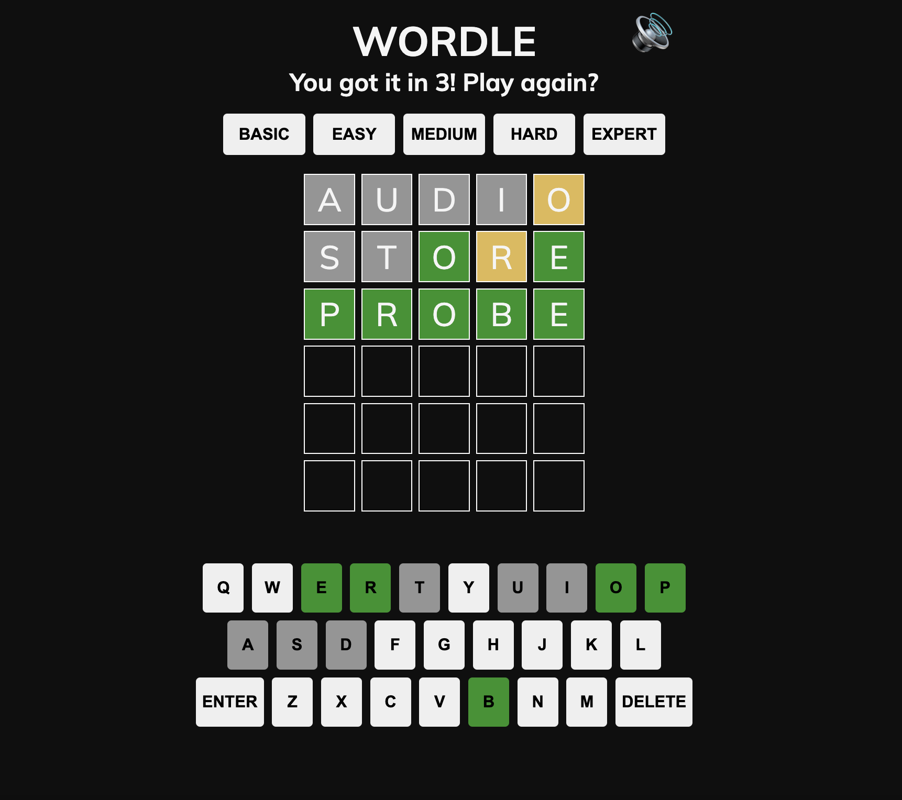

# Wordle Clone

This Wordle clone is a recreation of the game Wordle, popularized on the [New York Times](https://www.nytimes.com/games/wordle/index.html). The principle of the game remains the same: the app will generate a secret word, which the user has to guess in six tries or less. This clone allows the player to select a "difficulty" (basic, easy, medium, hard, expert), which determines the rarity of the word's use in the English language. After selecting the difficulty, the user begins inputting words. Upon making a valid guess, the colors will reveal information about the word to the user. If the letter is not in the word, the square will appear grey; if it is in the word but in the incorrect location, the square will appear yellow; and if it is in the word and in the correct location, the square will appear green. Upon a win or loss, the user can again select a difficulty and play another round. 

## [Play the game here](https://danielle-wordle-clone.netlify.app/)

## Technologies Used 

- JavaScript
- CSS
- HTML
- git 

## Attributions 

- Wordle Clone uses keyboard clicking sound found at: [freesound.org](https://freesound.org/people/Mcflarben/sounds/523768/)
- Wordle Clone uses a card flipping sound found at: [freesound.org](https://freesound.org/people/Splashdust/sounds/84322/)
- Wordle Clone uses the font Mulish, found at Google Fonts and available at: [GitHub](https://github.com/googlefonts/mulish)

## Ice Box 

- [ ] Light/dark mode 
- [ ] Animation when a letter is entered 
- [ ] Sound effect and animation on win/loss
- [ ] Sound effect on invalid guess 
- [ ] Filtering out plural words from list of possible secret words, but still allowing those words as guesses (ex: words would be an acceptable guess, but would never be the secret word)
- [ ] A feature where the user can change the length of the secret word 
- [ ] A feature to change the number of words a user is trying to guess at a time (ex: trying to guess 4 words simultaneously instead of just 1)